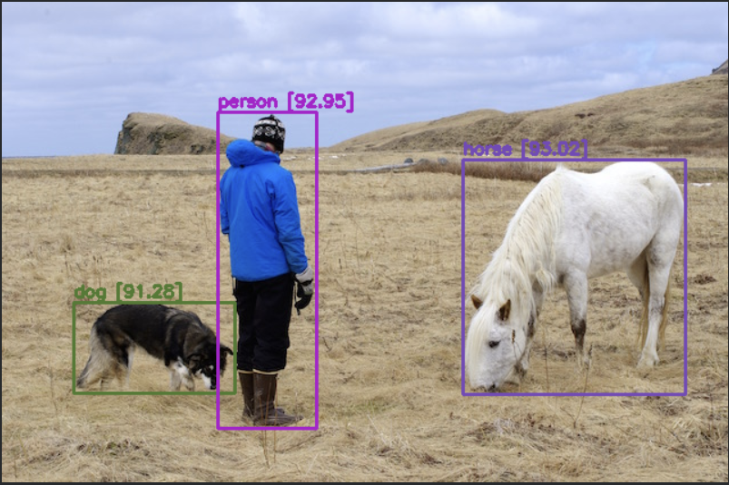

# YOLOv4 Object Detection

> Real-time object detection using the **YOLOv4** deep learning model, implemented in Python (Jupyter Notebook).

## 🎯 Overview

This project implements object detection with YOLOv4 — a fast, accurate single-stage detector — to identify and localize multiple objects in images. It covers loading the model, running inference, and visualizing bounding-box predictions with class labels and confidence scores.

## ✨ Features

- YOLOv4-based object detection on images
- Bounding boxes with class labels and confidence scores
- Notebook-driven, easy to follow and reproduce
- Configurable confidence and NMS (non-max suppression) thresholds

## 🛠️ Tech Stack

- **Python** (Jupyter Notebook)
- OpenCV / Deep learning framework for YOLOv4 inference
- NumPy, Matplotlib for processing and visualization

## 🚀 Getting Started

```bash
# Clone the repository
git clone https://github.com/arundhatibiswas/YOLOv4-Object-detection.git
cd YOLOv4-Object-detection

# (Recommended) create a virtual environment
python -m venv venv
venv\Scripts\activate        # Windows
# source venv/bin/activate   # macOS/Linux

# Install dependencies
pip install -r requirements.txt   # or install: opencv-python numpy matplotlib

# Launch the notebook
jupyter notebook
```

> Download the YOLOv4 weights/config and update the paths in the notebook before running inference.

## 📊 Results



## 👤 Author

**Arundhati Biswas** — Web Developer | AI/ML Enthusiast
- LinkedIn: https://www.linkedin.com/in/arundhati-biswas-387482276
- GitHub: https://github.com/arundhatibiswas
